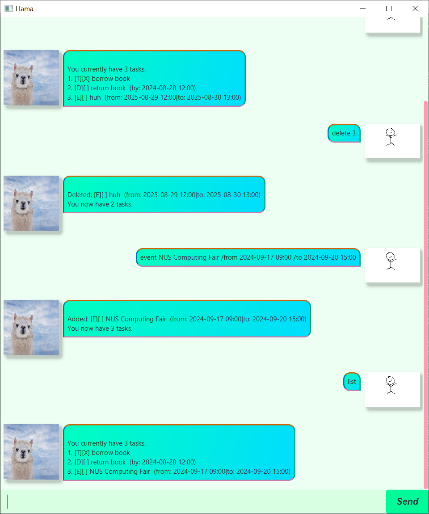

# Llama Project

This a chatbot named after the great land animal _Llama_. It is able to keep track of your tasks efficiently!
It is a desktop app for **managing tasks, optimized for use via a Command Line Interface (CLI)** while still having the 
**benefits of a Graphical User Interface (GUI)**. If you can type fast, Llama can get your task management done faster 
than traditional GUI apps.

### Table of Contents
* [Quick Start](#quick-start)
* [Features](#features)
  * [Adding todos: `todo`](#adding-todos-todo)
  * [Adding deadlines: `deadline`](#adding-deadlines-deadline)
  * [Adding events: `event`](#adding-events-event)
  * [Listing all tasks: `list`](#listing-all-tasks-list)
  * [Deleteing a task: `delete`](#deleteing-a-task-delete)
  * [Marking a task as done: `mark`](#marking-a-task-as-done-mark)
  * [Unmarking a task as done: `unmark`](#unmarking-a-task-as-done-unmark)
  * [Locating tasks by name: `find`](#locating-tasks-by-name-find)
  * [Create a tag: `create`](#create-a-tag-create)
  * [Tag a task: `tag`](#tag-a-task-tag)
  * [Untag a task: `untag`](#untag-a-task-untag)
  * [Exiting the program: `bye`](#exiting-the-program-bye)
* [Data management](#data-management)
  * [Saving the data](#saving-the-data)
  * [Editing the data file](#editing-the-data-file)

---

## Quick Start

### Setting up
1. Ensure that you have Java `17` installed on your computer.
2. Download the latest release [here](https://github.com/bmanara/ip/releases).
3. Copy the file to the folder you want to use as your _home folder_ for your Llama chatbot.
4. Open a command terminal, `cd` into the folder the `.jar`file is located at and use the command `java -jar Llama.jar`.
5. A GUI will appear after a few seconds.
6. Play and interact with the chatbot!
7. Refer to the Features below for details of all commands available.

---
## Features

ℹ️ Notes about the command format:

1. Words in `UPPER_CASE` are the parameters to be supplied by the user. 
 e.g. in `todo DESCRIPTION`, `DESCRIPTION` is a parameter which can be used as `todo borrow book`.
2. `DATE` must always be in the format `YYYY-MM-DD HH:mm`.
     e.g. in `deadline DESCRIPTION /by DATE`, it should be `deadline return book /by 2024-11-23 12:00`.
3. Parameters must be in the specified order. 
     e.g. if the command specifies `DESCRIPTION from/DATE`, it needs to follow this format strictly.
4. If you are using a PDF version of this document, be careful when copying and pasting commands that span multiple lines as space characters surrounding line-breaks may be omitted when copied over to the application.
---

### Adding todos: `todo`
Adds a task of type `todo` to the task list.

Format: `todo DESCRIPTION`

Example: `todo borrow book`

### Adding deadlines: `deadline`
Adds a deadline of type `deadline` to the task list.

Format: `deadline DESCRIPTION /by DATE`

Example: `deadline return book /by 2024-11-23 12:00`

### Adding events: `event`
Adds an event of type `event` to the task list.

Format: `event DESCRIPTION /from DATE /to DATE`

Example: `event project meeting /from 2024-11-23 12:00 /to 2024-11-23 14:00`

### Listing all tasks: `list`
Shows a list of all tasks in the task list.

Format: `list`

Sample Output: <add screenshot here>

### Deleteing a task: `delete`
Deletes a task from the task list.

Format: `delete TASK_NUMBER`

Example: `delete 3` deletes the 3rd task in the task list. 

### Marking a task as done: `mark`
Marks a task as done in the task list.

Format: `mark TASK_NUMBER`

Example: `mark 3` marks the 3rd task in the task list as done.

### Unmarking a task as done: `unmark`
Unmarks a task as done in the task list.

Format: `unmark TASK_NUMBER`

Example: `unmark 3` unmarks the 3rd task in the task list as done.

### Locating tasks by name: `find`
Finds tasks whose descriptions contain the given keyword.

Format: `find KEYWORD`

- The search is case-insensitive. e.g. `book` will match `Book`.
- Only the description is searched.
- Partial words will be matched. e.g. `book` will match `bookstore`.

Example: `find book` returns a list of tasks with the word `book` in their description.

### Create a tag: `create`
Creates a tag that can be used to tag a task.

Format: `create TAG_NAME`

Example: `create important`

### Tag a task: `tag`
Tags a task with an already existing tag.

> ℹ️ **NOTE**  
> The tag must already exist before it can be used to tag a task.
> Only one tag can be used to tag a task.

Format: `tag TASK_NUMBER /with TAG_NAME`

### Untag a task: `untag`
Untags a task with an already existing tag.

Format: `untag TASK_NUMBER`

### Exiting the program: `bye`
Exits the program after a 3-second delay.

Format: `bye`

---
##  Data management

### Saving the data
Llama chatbot will automatically save data on tasks and tags after any command that changes data. There is no need to save manually.

### Editing the data file
Llama data files can be located in [JAR file location]/data/tagFile.txt and [JAR file location]/data/taskFile.txt. 
